# Assignment of film api

   This API is written by node.js, express.js as server and using mongodb.client connecting to mongodb. Database called filmstore consist of 2 collections - film and user. The API achieves CRUD operation by POST, GET, UPDATE and DELETE. API is starteded by command "cd app" and "node app.js" in console. The workspace of this api is: [https://replit.com/@kcwong8051/myFilmstore](https://replit.com/@kcwong8051/myFilmstore) 

---
## Folder structure

```
+-- src
|   +-- app.js
|   +-- config.js
|   +-- filmcontroller.js
|   +-- filmroute.js
|   +-- usercontroller.js
|   +-- userroute.js
|   +-- Readme.md
```

---
## Database (filmstore) structure

### Collection (film)
1. _id: ObjectId 
2. Title: String
3. Year: String
4. imdbID: String
5. Type: String
6. Poster: String
7. createdt: Date

### Collection (user)
1. _id: ObjectId
2. username: String
3. password: String
4. email: String
5. role: String
6. firstname: String
7. surname: String
8. authorizedkey: String
9. createdt: Date
10. bookmark: Array
11. modifieddt: Date
12. rate: Array

---
## Endpoints

Film endpoints are routed by (1)film and (2)user. 

The url structure is:
> ```https://<host name>/<route>/<endpoint>```
   
### film route

| Function | HTTP Method | Endpoint | Url example |
| ------ | ------ | ------ | ------ |
| 1. Search film info by keyword | GET | /infofilm/:keyword | https://myFilmstore.kcwong8051.repl.co/film/infofilm/king |
| 2. Add films by batch | POST | /imfilms | https://myFilmstore.kcwong8051.repl.co/film/imfilms |
| 3. Add one film | POST | /imfilm | https://myFilmstore.kcwong8051.repl.co/film/imfilm | 
| 4. Search film info by key-pair value | GET | /film/:key/:value | https://myFilmstore.kcwong8051.repl.co/film/film/Title/king |
| 5. List films info | GET | /list | https://myfilmstore.kcwong8051.repl.co/film/list |
| 6. Update one film | PUT | /updatefilm/:imdbid | https://myfilmstore.kcwong8051.repl.co/film/updatefilm/tt0455590 |
| 7. Remove one film | DELETE | /removefilm/:imdbid | https://myfilmstore.kcwong8051.repl.co/film/removefilm/tt0455590 |
   
### user route
   
| Function | HTTP Method | Endpoint | Url example |
| ------ | ------ | ------ | ------ |
| I. Add users by batch | POST | /applys | https://myFilmstore.kcwong8051.repl.co/user/applys |
| II. Add one user | POST | /apply | https://myFilmstore.kcwong8051.repl.co/user/apply |
| III. Login | POST | /auth | https://myFilmstore.kcwong8051.repl.co/user/auth |
| IV. Update user info | PUT | /update | https://myFilmstore.kcwong8051.repl.co/user/update |
| V. Remove user | DELETE | /removeuser | https://myFilmstore.kcwong8051.repl.co/user/removeuser |
| VI. Bookmark film by user | POST | /bookmarkfilm/:imdbid | https://myFilmstore.kcwong8051.repl.co/user/bookmarkfilm/tt0455590 |
| VII. Rate film by user | POST | /ratefilm/:imdbid | https://myFilmstore.kcwong8051.repl.co/user/ratefilm/tt0455590 |
| VIII. List user(s) | GET | /list | https://myFilmstore.kcwong8051.repl.co/user/list |

---   
## Use Api scenario - implemented by [PostMan](https://www.postman.com/)
   
### 1. Search film info by keyword - film route
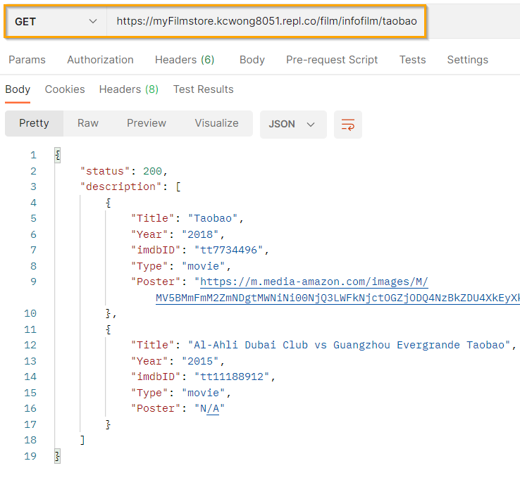

### 2. Add films by batch - film route
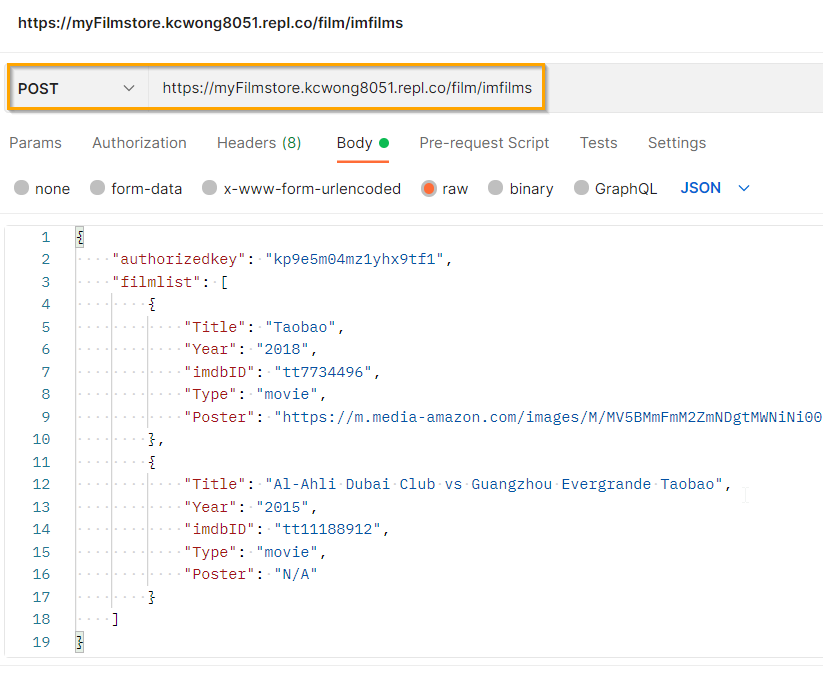
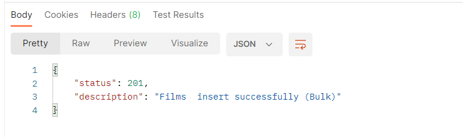   
   
### 3. Add one film - film route
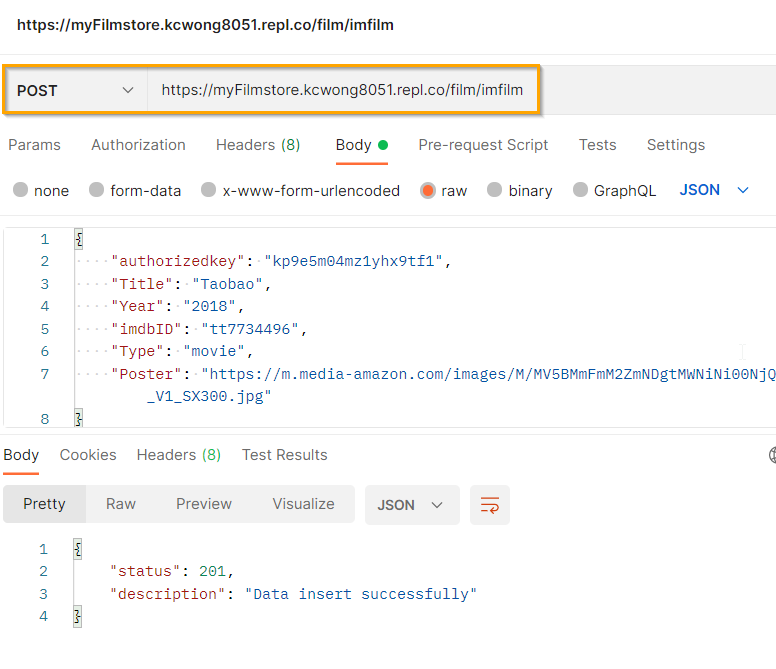

### 4. Search film info by key-pair value - film route
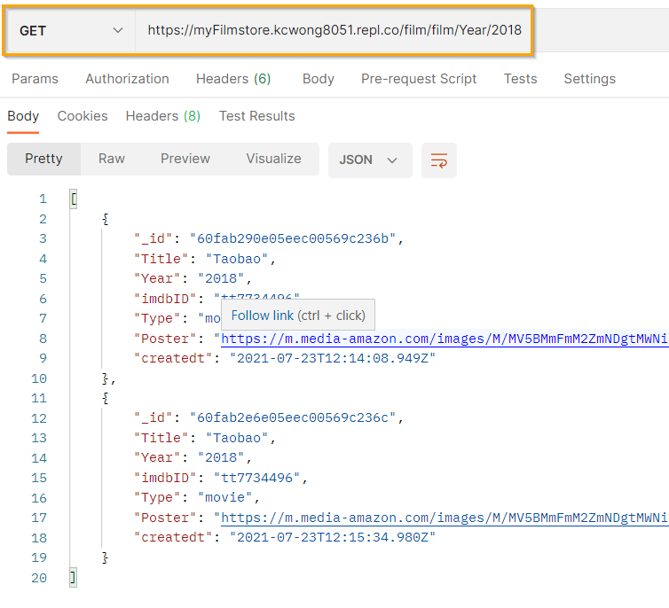
   
### 5. List films info - film route
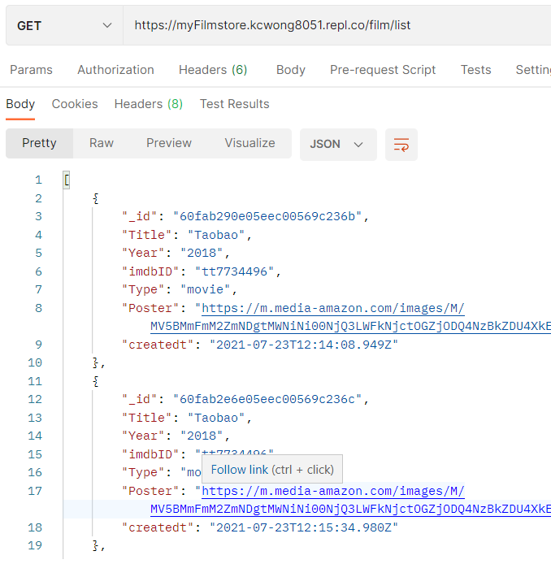

### 6. Update one film - film route
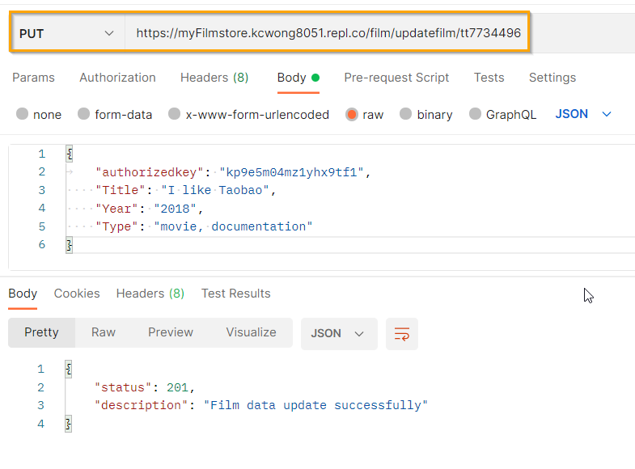
   
### 7. Remove one film - film route
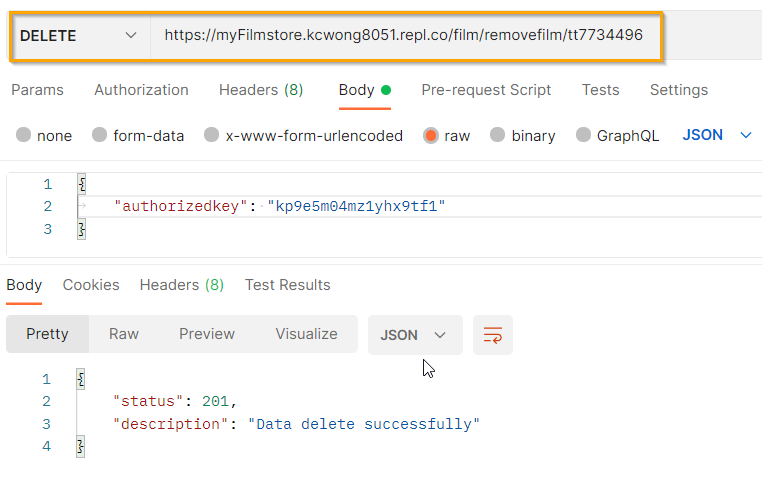

### I. Add users by batch - user route
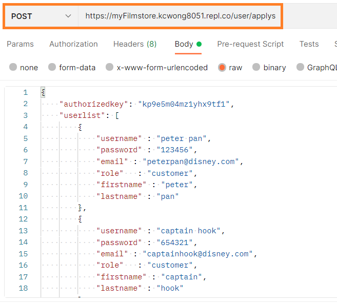
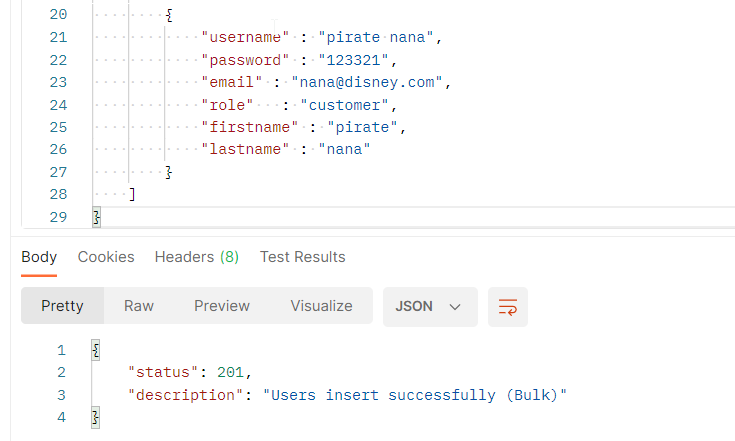
   
### II. Add one user - user route
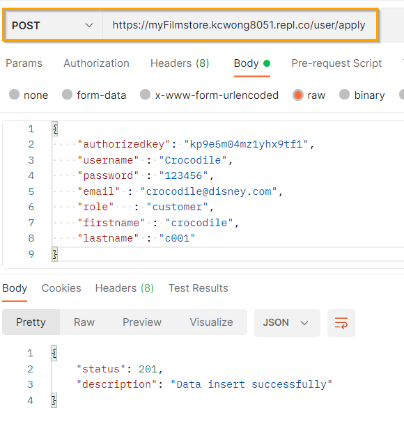
   
### III. Login - user route
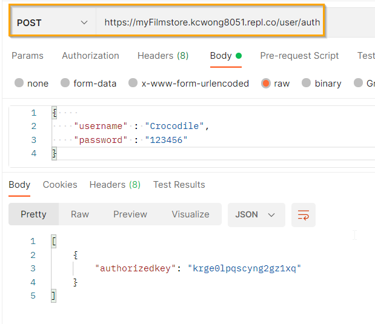
   
### IV. Update user info
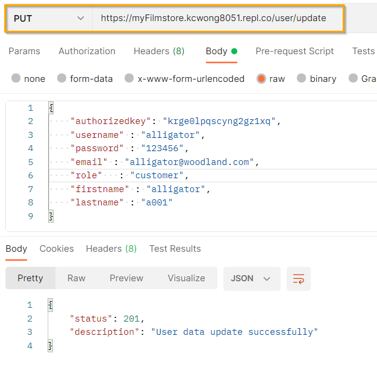
   
### V. Remove user
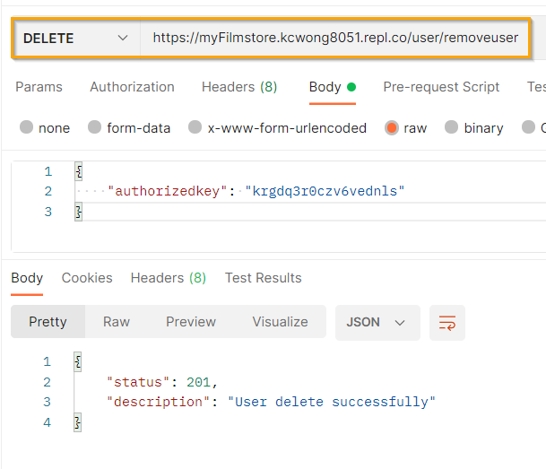   
   
### VI. Bookmark film by user x 2 times
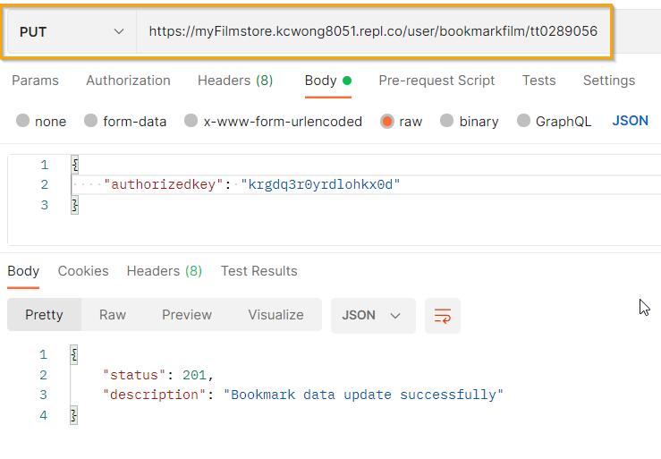
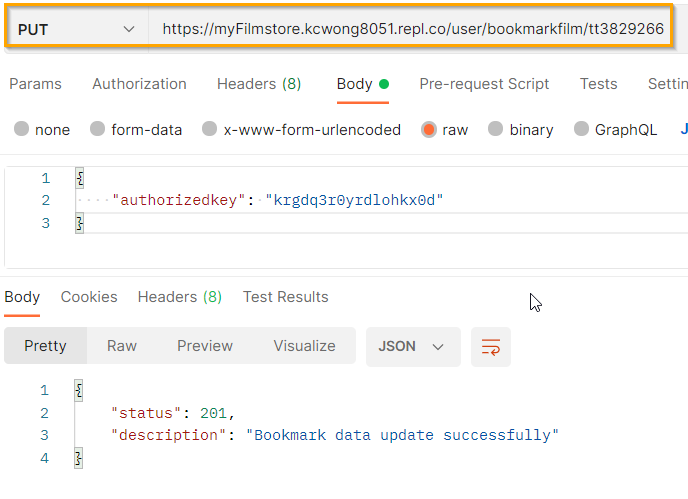
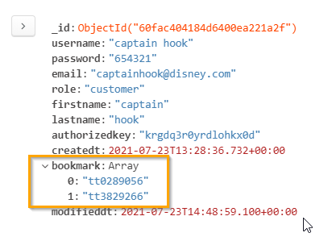
   
### VII. Rate film by user x 2 times
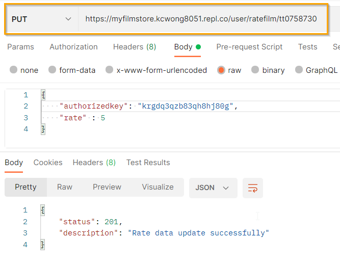
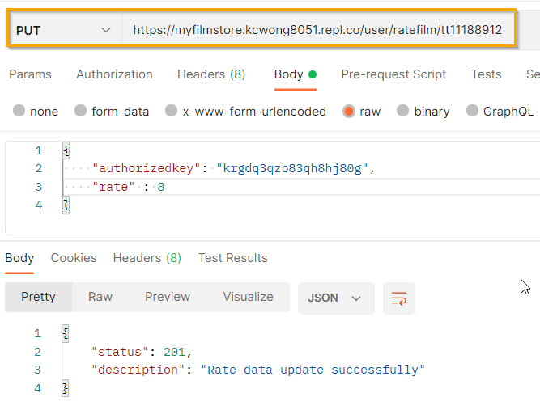
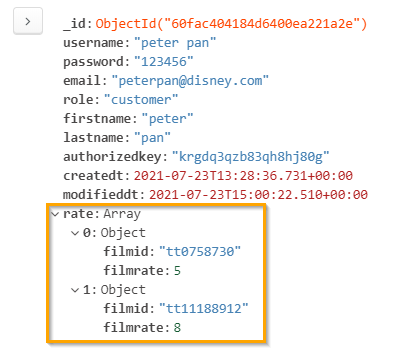
   
### VIII. List user(s)
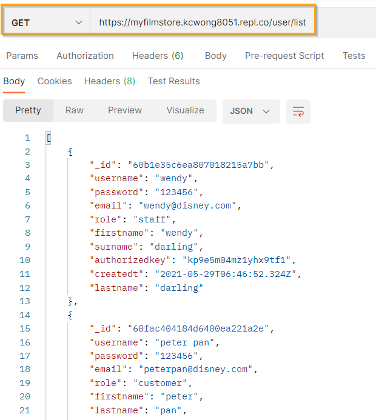
   
## Video for demo
[](https://vimeo.com/557297022/4af159cdad)
[](https://vimeo.com/557303528/a94fb63bbf)
   
## License

MIT

## About

Course: Professional Diploma in Cross-platform Applications Development (API)

Student: Wong Ka Chun

Date: 2021-07-23
